|图片|标签|名称|
| ------------ | ------------ | ------------ |
||DIAMOND|至纯源石|
||DIAMOND_SHD|合成玉|
||EXGG_SHD|采购凭证|
||GOLD|龙门币|
||HGG_SHD|高级凭证|
||LGG_SHD|资质凭证|
|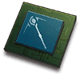|MTL_ASC_CST1|术士芯片|
|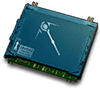|MTL_ASC_CST2|术士芯片组|
|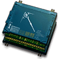|MTL_ASC_CST3|术士双芯片|
|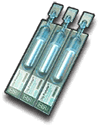|MTL_ASC_DI|芯片助剂|
||MTL_ASC_GRD1|近卫芯片|
|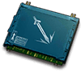|MTL_ASC_GRD2|近卫芯片组|
|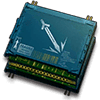|MTL_ASC_GRD3|近卫双芯片|
||MTL_ASC_MED1|医疗芯片|
|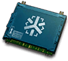|MTL_ASC_MED2|医疗芯片组|
|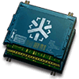|MTL_ASC_MED3|医疗双芯片|
|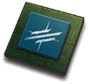|MTL_ASC_PIO1|先锋芯片|
|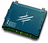|MTL_ASC_PIO2|先锋芯片组|
|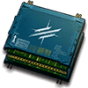|MTL_ASC_PIO3|先锋双芯片|
|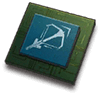|MTL_ASC_SNP1|狙击芯片|
|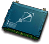|MTL_ASC_SNP2|狙击芯片组|
|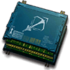|MTL_ASC_SNP3|狙击双芯片|
|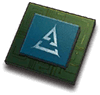|MTL_ASC_SPC1|特种芯片|
|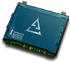|MTL_ASC_SPC2|特种芯片组|
|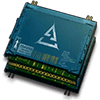|MTL_ASC_SPC3|特种双芯片|
||MTL_ASC_SUP1|辅助芯片|
|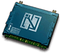|MTL_ASC_SUP2|辅助芯片组|
|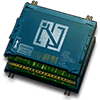|MTL_ASC_SUP3|辅助双芯片|
||MTL_ASC_TNK1|重装芯片|
|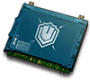|MTL_ASC_TNK2|重装芯片组|
|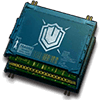|MTL_ASC_TNK3|重装双芯片|
||MTL_BASE_ESS|龙骨|
||MTL_BASE_SL1|碳|
|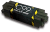|MTL_BASE_SL2|碳素|
|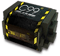|MTL_BASE_SL3|碳素组|
||MTL_BASE_SL3|碳素组|
|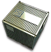|MTL_BASE_SYNTH1|基础加固建材|
|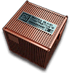|MTL_BASE_SYNTH2|进阶加固建材|
|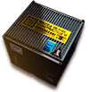|MTL_BASE_SYNTH3|高级加固建材|
||MTL_DIAMOND_SHD|源石碎片|
|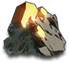|MTL_GOLD1|MTL_GOLD1|
|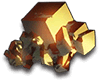|MTL_GOLD2|MTL_GOLD2|
|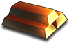|MTL_GOLD3|赤金|
||MTL_SKILL1|技巧概要·卷1|
||MTL_SKILL2|技巧概要·卷2|
||MTL_SKILL3|技巧概要·卷3|
||MTL_SL_ALCOHOL1|扭转醇|
|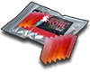|MTL_SL_ALCOHOL2|白马醇|
|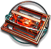|MTL_SL_BN|双极纳米片|
|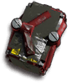|MTL_SL_BOSS1|破损装置|
||MTL_SL_BOSS2|装置|
||MTL_SL_BOSS3|全新装置|
|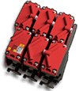|MTL_SL_BOSS4|改量装置|
||MTL_SL_DS|D32钢|
|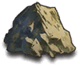|MTL_SL_G1|源岩|
|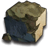|MTL_SL_G2|固源岩|
|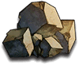|MTL_SL_G3|固源岩组|
|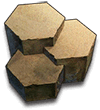|MTL_SL_G4|提纯源岩|
|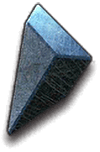|MTL_SL_IRON1|异铁碎片|
|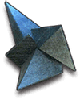|MTL_SL_IRON2|异铁|
|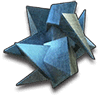|MTL_SL_IRON3|异铁组|
|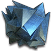|MTL_SL_IRON4|异铁块|
|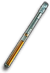|MTL_SL_KETONE1|双酮|
||MTL_SL_KETONE2|酮凝集|
|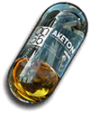|MTL_SL_KETONE3|酮凝集组|
|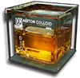|MTL_SL_KETONE4|酮阵列|
|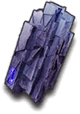|MTL_SL_MANGANESE1|轻锰矿|
|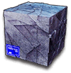|MTL_SL_MANGANESE2|三水锰矿|
|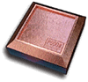|MTL_SL_PG1|研磨石|
|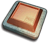|MTL_SL_PG2|五水研磨石|
||MTL_SL_PP|聚合剂|
||MTL_SL_RMA7012|RMA70-12|
|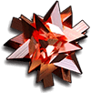|MTL_SL_RMA7024|RMA70-24|
||MTL_SL_RUSH1|酯原料|
||MTL_SL_RUSH2|聚酸酯|
|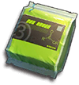|MTL_SL_RUSH3|聚酸酯组|
||MTL_SL_RUSH4|聚酸酯块|
||MTL_SL_STRG1|代糖|
||MTL_SL_STRG2|糖|
||MTL_SL_STRG3|糖组|
||MTL_SL_STRG4|糖聚块|
||sprite_exp_card_t1|基础作战记录|
||sprite_exp_card_t2|初级作战记录|
||sprite_exp_card_t3|中级作战记录|
||sprite_exp_card_t4|高级作战记录|
||TKT_INST_FIN|加急许可|
||TKT_RECRUIT|招聘许可|